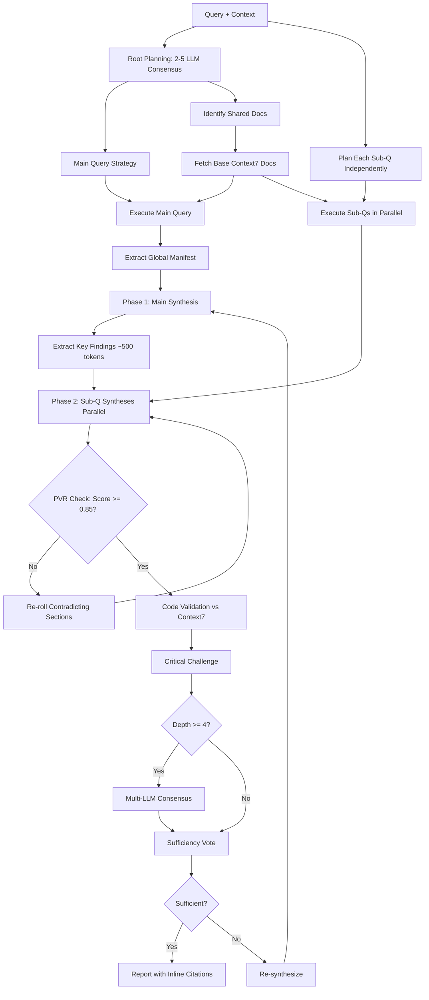

# Research MCP Server

<div align="center">

**Intelligent multi-source research orchestration for AI assistants**

</div>

## Overview

Research MCP Server is a Model Context Protocol (MCP) server that provides **consensus-driven, multi-source research capabilities** to AI assistants like Claude, ChatGPT, and other MCP-compatible clients. It uses **3-5 LLMs to vote on research strategy**, then dynamically orchestrates research across web search, academic papers, library documentation, and AI reasoning—delivering comprehensive, validated insights with built-in fact-checking.

### Why Research MCP?

- **Consensus Planning**: 2-5 LLMs vote on research strategy + independent planning for each sub-question
- **Production-Ready Reports**: Enforced numeric specificity, no placeholder code, explicit success criteria
- **Phased Synthesis**: Token-efficient approach with key findings extraction (~40% fewer tokens)
- **Code Validation**: Post-synthesis validation against Context7 docs catches hallucinated code
- **Inline Citations**: Every claim sourced (`[perplexity:url]`, `[context7:lib]`, `[arxiv:id]`)
- **Multi-Model Validation**: Critical challenge + consensus validation by multiple LLMs
- **Actionability Checklist**: Synthesis evaluated for specificity, completeness, and contradiction-free output
- **Context-Efficient Reports**: Sectioned architecture with on-demand reading (prevents AI context bloat)
- **Dynamic Execution**: Custom research plans with parallel processing
- **Multi-Source Synthesis**: Combines Perplexity, arXiv, Context7, and direct LLM reasoning

## Features

### Core Capabilities

- **Adaptive Research Planning**: Root consensus + independent sub-question planning
- **Multi-Source Search**:
  - Web search via Perplexity API
  - Academic papers via arXiv with AI-generated summaries
  - Library documentation via Context7 (with shared + specific doc fetching)
  - Deep reasoning
- **Parallel Processing**: Main query + sub-questions execute simultaneously
- **Phased Synthesis**: Main synthesis → key findings extraction → sub-Q synthesis (token-efficient)
- **Code Validation**: Post-synthesis validation against Context7 documentation
- **Validation Pipeline**: Critical challenge + multi-model consensus + sufficiency voting

## 🚀 Installation

### Prerequisites

- **Node.js 18+**
- API keys for:
  - [Perplexity API](https://www.perplexity.ai/)
  - [Google AI (Gemini)](https://ai.google.dev/)
  - [OpenAI API](https://platform.openai.com/)
  - [Context7](https://context.ai/) (for library documentation)

### Quick Start

```bash
# Clone the repository
git clone https://github.com/yourusername/research-mcp.git
cd research-mcp

# Install dependencies
npm install
# or
bun install

# Build TypeScript
npm run build
```

### Integration with MCP Clients

#### Claude Desktop / Cursor

Add to your MCP configuration file:

**Claude Desktop**: `~/Library/Application Support/Claude/claude_desktop_config.json`
**Cursor**: `~/.cursor/mcp.json`

```json
{
  "mcpServers": {
    "research": {
      "command": "node",
      "args": ["/path/to/deep-research-mcp/dist/index.js"],
      "env": {
        "PERPLEXITY_API_KEY": "your-key",
        "GEMINI_API_KEY": "your-key",
        "OPENAI_API_KEY": "your-key",
        "ARXIV_STORAGE_PATH": "/path/to/storage/",
        "CONTEXT7_API_KEY": "your-key"
      }
    }
  }
}
```

Restart your client after adding the configuration.

## 💡 Usage

### Basic Example (Async Pattern)

Ask your AI assistant to use the research tool:

```
I need to research transformer architectures.
Can you use the start_research tool to give me a comprehensive overview?
```

The AI will call:
```json
{
  "query": "How do transformer architectures work?",
  "depth_level": 2
}
```

Then poll with `check_research_status` using the returned `job_id`.

### Reading Research Report Citations

When personas cite research using format `[R-135216:5-19]`, you can verify the content:

```
Use the read_report tool to verify what the persona cited:
{
  "citation": "[R-135216:5-19]"
}
```

This returns lines 5-19 from report R-135216.

### Advanced Example with Rich Context

```
I'm building an AI memory companion that extracts entities and deduplicates memories.
I need to create 600+ test examples for evaluation, but my current template-based
approach creates unrealistic data. Research the best approaches for creating
high-quality evaluation datasets.

Context:
- Solo developer with 20 hour budget
- Already reviewed papers on Excel formula repair and DAHL biomedical benchmark
- Found that synthetic data is 40% simpler than real data
- Random template filling doesn't work

Specific questions:
1. What makes evaluation data representative?
2. How to generate hard negatives?

Tech stack: Python, Neo4j, LangSmith
```

This triggers a sophisticated research session with:
```json
{
  "query": "How to create high-quality evaluation datasets for LLM testing?",
  "project_description": "AI memory companion with semantic extraction/dedup",
  "current_state": "85 test examples, need 600+",
  "problem_statement": "Template-based generation creates unrealistic data",
  "constraints": ["Solo developer", "20 hours"],
  "domain": "LLM evaluation datasets",
  "depth_level": 4,
  "papers_read": ["Excel formula repair", "DAHL biomedical benchmark"],
  "key_findings": ["Synthetic data 40% simpler than real data"],
  "rejected_approaches": ["Random template filling"],
  "sub_questions": [
    "What makes evaluation data representative?",
    "How to generate hard negatives?"
  ],
  "tech_stack": ["Python", "Neo4j", "LangSmith"],
  "output_format": "actionable_steps",
  "include_code_examples": true
}
```

### Saving Research Reports

You can save research outputs as local markdown files by setting `report: true`:

```json
{
  "query": "How do transformer architectures work?",
  "depth_level": 3,
  "report": true,
  "report_path": "/Users/name/Documents/research/"  // optional
}
```

**Default behavior**:
- Reports saved to `~/research-reports/`
- Filename format: `research-YYYY-MM-DD-sanitized-query.md`
- Example: `research-2025-12-10-how-do-transformer-architectures-work.md`
- File path included in response

**Custom directory**: Use `report_path` parameter to specify a different location.

### Available Tools

The MCP server exposes five tools:

1. **`start_research`** - Async research orchestrator with rich parameters (returns job_id immediately)
2. **`check_research_status`** - Poll async job status and retrieve results when complete
3. **`read_report`** - Read specific lines from research reports using citation format (e.g., `[R-135216:5-19]`)
4. **`read_paper`** - Passthrough to arXiv MCP for reading full papers
5. **`download_paper`** - Passthrough to arXiv MCP for downloading PDFs

### Parameters Reference

| Parameter | Type | Description |
|-----------|------|-------------|
| `query` | string | **Required**. Your research question |
| `depth_level` | 1-5 | Research depth (auto-detected if omitted) |
| `project_description` | string | What you're building |
| `current_state` | string | Where you are now |
| `problem_statement` | string | The specific problem to solve |
| `constraints` | string[] | Time/budget/technical limits |
| `domain` | string | Research domain/area |
| `papers_read` | string[] | Papers already reviewed (prevents redundancy) |
| `key_findings` | string[] | What you already know |
| `rejected_approaches` | string[] | Approaches already ruled out |
| `sub_questions` | string[] | Specific questions to answer in parallel |
| `tech_stack` | string[] | Technologies in use (triggers Context7 docs) |
| `output_format` | enum | `summary`, `detailed`, or `actionable_steps` |
| `include_code_examples` | boolean | Whether to fetch code examples |
| `date_range` | string | Preferred date range (e.g., "2024-2025") |
<!-- TODO | `for_panel` | boolean | Return structured JSON for agent-chat panel integration (includes `report_id` for citations) | -->


## 🔍 How It Works

### Intelligent Research Architecture (v2)

The research system uses a sophisticated phased approach designed for token efficiency and code accuracy:

#### Phase 1: Root Planning
- **Consensus voting** by 2-5 LLMs determines research complexity (1-5)
- Root planner creates strategy for **main query only**
- Identifies **shared documentation** needs (base API/syntax docs)
- Each sub-question gets **independent planning** (lightweight, fast)

#### Phase 2: Parallel Data Gathering
- **Shared Context7 docs** fetched once for all queries (e.g., "React basics")
- Main query executed with full tool access
- **Sub-questions planned independently** via fast LLM calls
  - Each sub-Q chooses its own tools (context7, perplexity, arxiv)
  - Can request **specific Context7 topics** beyond shared docs
- All gathering happens in parallel for speed

#### Phase 3: Phased Synthesis (Token-Efficient)
1. **Main query synthesis** - comprehensive answer to primary question
2. **Key findings extraction** - ~500 token summary of main conclusions
3. **Sub-question synthesis** - parallel, with key findings injected for coherence
   - Prevents contradictions between main and sub-answers
   - Each sub-Q synthesis uses only relevant data (not all research)

#### Phase 4: Code Validation Pass
- Extracts all code blocks from synthesized report
- Validates against **authoritative Context7 documentation**
- Fixes hallucinated APIs, outdated syntax, incorrect method names
- Context7 becomes source of truth for code accuracy

#### Phase 4.5: PVR Consistency Verification
Based on [arxiv:2310.03025](https://arxiv.org/abs/2310.03025) and [arxiv:2305.14251](https://arxiv.org/abs/2305.14251):

- **Global Constraint Manifest**: Extract key facts from sources BEFORE synthesis
- **Cross-Sectional NLI**: Check claims across sections for contradictions
- **Entailment Scoring**: Target score >= 0.85 (research-backed threshold)
- **Speculative Re-rolling**: Only regenerate contradicting sections (not all)
- Result: 98% consistency at 6x speed vs sequential processing

Key thresholds (from research):
| Metric | Value | Source |
|--------|-------|--------|
| Entailment threshold | 0.85 | arxiv:2310.03025 |
| Verification timeout | 5s | Industry standard |
| Max re-roll attempts | 2 | Prevent infinite loops |

#### Phase 5: Multi-Model Validation
- **Critical Challenge**: LLM attacks synthesis to find gaps
- **Consensus** (depth >= 4): 3 LLMs validate findings
- **Sufficiency Vote**: Synthesis vs. critique
- Re-synthesis if significant gaps found

### Why This Architecture?

**Token Efficiency:**
- Phased synthesis uses ~40% fewer tokens vs. monolithic approach
- Sub-questions don't see full main query data dump
- Key findings summary prevents redundant context

**Code Accuracy:**
- Context7 validation catches hallucinated code before delivery
- Inline citations trace every claim to source
- Docs fetched once and cached for validation pass

**Consistency Guarantees (PVR):**
- Global Constraint Manifest ensures all sections share consistent facts
- Cross-sectional NLI detects contradictions between sections
- Speculative re-rolling fixes only contradicting sections (6x faster than sequential)
- Research-backed 0.85 entailment threshold (arxiv:2310.03025)
- 98% consistency vs sequential processing

**Research Quality:**
- Independent sub-Q planning prevents bias from root plan
- Each sub-Q gets optimal tool selection
- Key findings injection ensures coherent, non-contradictory answers
- Synthesis LLMs use temperature=0.2 for deterministic, specific outputs
- Production engineer persona prompt for deployable solutions
- Explicit numeric specificity mandates (no "high", "fast", "good")
- Few-shot examples enforce production-ready code (no TODO/FIXME)
- Checklist-based validation audits actionability before delivery

### Research-Backed Validation

The validation layer implements techniques from recent AI research to ensure high-quality, factual outputs:

**Diverse LLM Ensembles** (R-212511, R-214931):
- Uses 3+ different model architectures for voting (Gemini, GPT-4o-mini, Claude Haiku)
- Research shows diverse ensembles achieve **>98.8% success rates** vs same-model ensembles
- Multiple small diverse models outperform single large models for consensus tasks
- Mitigates correlated errors and systemic biases through architectural diversity

**Context-Grounded Validation** (arxiv:2510.02340v2, arxiv:2403.12958v2):
- Validators receive atomic facts from web searches and papers as explicit grounding context
- Prompts instruct LLMs to rely *solely* on provided external context over parametric knowledge
- Solves knowledge cutoff issues - prevents false positives on recent information (e.g., new AI models)
- **>95% effective** at preventing outdated knowledge from causing validation failures

**BetterBench Code Criteria** (arxiv:2411.12990v1):
- Distinguishes **illustrative code** (placeholders OK if labeled) from **production code** (no placeholders)
- Placeholder API keys (`YOUR_API_KEY`) are security best practices, not critical gaps
- Clearly labeled mocks and conceptual examples are acceptable for demonstration purposes
- Prevents false failures on pedagogically appropriate code examples

### Research Flow Diagram




| Depth | Perplexity | Deep | Context7 | arXiv | Consensus | Challenge | Voting | Code |
|-------|------------|------|----------|-------|-----------|-----------|--------|------|
| 1     | Yes        | No   | No       | No    | No        | No        | No     | No   |
| 2     | Yes        | Yes  | No       | No    | No        | Yes       | No     | No   |
| 3     | Yes        | Yes  | Yes      | No    | No        | Yes       | Yes    | Yes  |
| 4     | Yes        | Yes  | Yes      | Yes   | Yes       | Yes       | Yes    | Yes  |

### Inline Citations

Reports now include **inline source citations** for traceability:

- `[perplexity:url]` - Web search finding
- `[context7:library-name]` - Library documentation/code
- `[arxiv:paper-id]` - Academic paper
- `[deep_analysis]` - LLM reasoning

Example:
```markdown
LangSmith provides dataset management [context7:langsmith] which supports 
version control [perplexity:langsmith-docs] as validated in recent research 
[arxiv:2024.12345].
```

### Context-Efficient Report Structure

Reports use **sectioned architecture** for AI consumption:

1. **Executive Summary** - Overview + section index with IDs and line ranges
2. **On-demand Section Reading** - AI can load specific sections only
3. **Quick Reference** - Citation examples (`R-ID:section`, `R-ID:section:20-50`)

Example usage:
```
read_report(citation="R-182602:q1")          # Read sub-question 1
read_report(citation="R-182602:q1:20-50")    # Lines 20-50 of sub-Q 1
read_report(citation="R-182602", full=true)  # Full report (last resort)
```

This prevents context bloat - AI assistants load only what they need.

### Common Issues

#### Perplexity API Errors

- **401 Unauthorized**: Check that `PERPLEXITY_API_KEY` is set correctly
- **429 Rate Limited**: You've exceeded API quota. Check [Perplexity dashboard](https://www.perplexity.ai/)
- **Connection timeout**: Verify network connectivity

#### Context7 or arXiv Connection Issues

These are spawned as subprocesses. Check:
```bash
# Verify Context7 MCP is accessible (if installed separately)
# Verify arXiv MCP server is installed:
uv tool run arxiv-mcp-server --help
```

**arXiv MCP Server Initialization Failures (EOF errors in isolated environments):**

If you see `Error: calling "initialize": EOF` in environments with restricted PATH (e.g., Antigravity, CI/CD), the server may not be able to find the `uv` binary. Solutions:

1. **Set UV_BINARY_PATH environment variable** (Recommended for isolated environments):
```json
{
  "mcpServers": {
    "research": {
      "command": "node",
      "args": ["/path/to/deep-research-mcp/dist/index.js"],
      "env": {
        "UV_BINARY_PATH": "/opt/homebrew/bin/uv",  // Apple Silicon
        // or "/usr/local/bin/uv" for Intel Mac / Linux
        "PERPLEXITY_API_KEY": "your-key",
        "GEMINI_API_KEY": "your-key"
      }
    }
  }
}
```

2. **Install uv** if not already installed:
```bash
curl -LsSf https://astral.sh/uv/install.sh | sh
```

3. **Common uv installation paths** (checked automatically if not in PATH):
   - `/opt/homebrew/bin/uv` (Apple Silicon Homebrew)
   - `/usr/local/bin/uv` (Intel Mac Homebrew / Linux)
   - `~/.local/bin/uv` (User-local installation)
   - `~/.cargo/bin/uv` (Cargo installation)

The server now uses **lazy initialization** - the arXiv client is only created when `read_paper` or `download_paper` tools are actually called, preventing initialization failures.
#### MCP Client Not Detecting Server

1. Verify the path in your MCP config is correct (absolute path)
2. Restart your MCP client (Claude Desktop, Cursor, etc.)
3. Check client logs for connection errors:
   - **Claude Desktop**: `~/Library/Logs/Claude/`
   - **Cursor**: Developer Tools → Console

#### Environment Variables Not Loading

If you see "Not connected" errors despite having API keys in your MCP config, try these solutions:

**Option 1: Use built JavaScript file** (Recommended)
```json
{
  "mcpServers": {
    "research": {
      "command": "node",
      "args": ["/absolute/path/to/research-mcp/dist/index.js"],
      "env": {
        "PERPLEXITY_API_KEY": "your-key",
        "GEMINI_API_KEY": "your-key",
        "OPENAI_API_KEY": "your-key"
      }
    }
  }
}
```

**Option 2: Fix path with spaces**

If your path contains spaces (e.g., `/Users/name/Desktop/Personal and learning/...`):
```json
{
  "command": "npx",
  "args": [
    "tsx",
    "/Users/name/Desktop/Personal and learning/quick-mcp/research/src/index.ts"
  ]
}
```

Note: Paths with spaces are properly handled in JSON arrays. The issue is usually using source files instead of built files.

### Example Output Structure

```markdown
# Research Results: [Your Query]

## Complexity Assessment

**Level**: 4/5
**Reasoning**: Complex research requiring academic papers and library documentation

## Research Action Plan

**Estimated Time**: ~45s

**Steps Executed**:
1. **perplexity**: Search for recent approaches and best practices _(parallel)_
2. **deep_analysis**: Analyze web findings for technical insights
3. **context7**: Fetch React and TypeScript documentation _(parallel, shared + specific)_
4. **arxiv**: Search academic papers on evaluation datasets
5. **consensus**: Validate findings across multiple models

## Synthesis with Inline Citations

### Overview

LangSmith provides comprehensive dataset management [context7:langsmith] which enables
evaluation workflow automation [perplexity:langsmith-docs]. Recent research shows that
synthetic data generation requires careful attention to distribution matching [arxiv:2024.12345].

\`\`\`typescript
// Code validated against Context7
import { Dataset } from "langsmith";

const dataset = new Dataset("my-eval-set");
\`\`\`

### Sub-Question 1: What makes evaluation data representative?

Representative data must match real-world distributions [deep_analysis] and include
edge cases from production logs [context7:langsmith]. Studies indicate that 600+ examples
provide sufficient statistical power for small effect detection [arxiv:2024.67890].

## Code Validation Summary

✅ 3 code blocks validated
✅ 1 syntax correction applied (outdated API method)

## Multi-Model Consensus
[3 LLMs validated findings—shows agreement/disagreement]

## Critical Challenge
[Critical validation—alternative perspectives and gaps identified]

## Quality Validation

**Vote Result**: 2 sufficient, 1 insufficient
**Status**: ✅ Response is sufficient

**Model Feedback**:
- ✅ **gemini-3-flash-preview**: Response comprehensively addresses the query with actionable steps
- ✅ **gpt-5-mini-2025-08-07**: Good coverage of edge cases and validation methods
- ❌ **claude-3.5-haiku**: Could benefit from more code examples

---

**Report ID**: R-182602

**Usage Examples**:
\`\`\`
read_report(citation="R-182602:overview")      # Read overview section
read_report(citation="R-182602:q1")            # Read sub-question 1
read_report(citation="R-182602:q1:20-50")      # Lines 20-50 of sub-Q 1
read_report(citation="R-182602", full=true)    # Full report (last resort)
\`\`\`
```

## This MCP is built on top of other MCP servers and tools

- [Perplexity AI](https://www.perplexity.ai/) - Web search capabilities
- [arXiv](https://arxiv.org/) - Academic paper repository
- [Context7](https://context7.com/) - Library documentation search
- All contributors and users of this project

## Benchmarking

This project includes comprehensive benchmarking tools to compare MCP research quality against Perplexity baseline:

### Running Benchmarks

```bash
# Generate responses for benchmark dataset
npm run benchmark:generate              # Generate only missing responses
npm run benchmark:generate:new-set      # Clear all responses and start fresh

# Run full benchmark comparison (generates new results)
npm run benchmark:compare

# View latest benchmark results
npm run benchmark:view

# Compare multiple benchmark runs over time
npm run benchmark:compare-results
```

**Response Generation Options:**
- `benchmark:generate` - Only generates responses for samples that don't have them yet (incremental)
- `benchmark:generate:new-set` - Clears ALL existing responses and regenerates from scratch (use after codebase changes)

This allows you to:
1. Make changes to your research codebase
2. Run `npm run benchmark:generate:new-set` to regenerate all responses with the new code
3. Compare results with previous benchmarks using `benchmark:compare-results`

### Viewing Results

After running benchmarks, you can easily view results anytime:

- **`npm run benchmark:view`** - Shows detailed decision matrix with recommendations
- **`npm run benchmark:compare-results`** - Compares multiple runs side-by-side with trend indicators (↑↓→)

Example output from `benchmark:view`:
```
================================================================================
DECISION MATRIX: MCP vs Perplexity
Generated: 2025-12-21T02:17:33.512Z
Total Comparisons: 69
================================================================================

RECOMMENDATIONS
--------------------------------------------------------------------------------

Use Perplexity for:
  - multi_hop_reasoning (win rate: 80%, p<0.05)
  - synthesis (win rate: 90%, p<0.05)
  - latency-critical tasks (<2s vs ~5min)

No clear winner (prefer lower cost):
  - single_hop_factual (60% vs 40%, p=0.63)

DETAILED BREAKDOWN
--------------------------------------------------------------------------------
Category              | MCP Win  | P(Sup)  | 95% CI          | Recommendation
--------------------------------------------------------------------------------
single_hop_factual    | 60%      | 0.63    | [-0.80, 1.30]   | TIE
multi_hop_reasoning   | 20%      | 0.01    | [-2.20, -0.35]  | USE_PERPLEXITY

SWITCHING POINTS:
  - Simple factual lookup: USE PERPLEXITY (faster)
```

Example output from `benchmark:compare-results`:
```
====================================================================================================
BENCHMARK COMPARISON
2 benchmark runs found
====================================================================================================

Category              | Run 1         | Run 2         
----------------------|---------------|---------------
                      | Dec 20, 09:30 | Dec 21, 02:17 
----------------------|---------------|---------------
single_hop_factual    | 70%           | 60% ↓         
multi_hop_reasoning   | 30%           | 20% ↓         
synthesis             | 10% →         | 10% →         

RECOMMENDATION CHANGES
----------------------------------------------------------------------------------------------------
single_hop_factual: Run 1: TIE → Run 2: TIE
multi_hop_reasoning: Run 1: TIE → Run 2: USE_PERPLEXITY

Legend: ↑ = improved, ↓ = declined, → = stable
```

Results are stored in `benchmarks/results/` as JSON files with timestamps.