# Research MCP Server

<div align="center">

**Intelligent multi-source research orchestration for AI assistants**

</div>

## Overview

Research MCP Server is a Model Context Protocol (MCP) server that provides **consensus-driven, multi-source research capabilities** to AI assistants like Claude, ChatGPT, and other MCP-compatible clients. It uses **3-5 LLMs to vote on research strategy**, then dynamically orchestrates research across web search, academic papers, library documentation, and AI reasoning—delivering comprehensive, validated insights with built-in fact-checking.

### Why Research MCP?

- **Consensus Planning**: 3-5 LLMs vote on complexity and create dynamic action plans (not fixed templates)
- **Multi-Model Validation**: Every finding validated by multiple LLMs + critical challenge phase
- **Dynamic Execution**: Executes custom research plans with parallel processing
- **Multi-Source Synthesis**: Combines Perplexity, arXiv, Context7, and direct LLM reasoning
- **Context-Aware**: Avoids redundancy using `papers_read`, `key_findings`, `rejected_approaches`
- **Clean Output**: Structured markdown (no raw JSON dumps)—shows action plan + validated findings

## Features

### Core Capabilities

- **Adaptive Research Planning**: Uses consensus to create optimal research strategy based on your parameters
- **Multi-Source Search**:
  - Web search via Perplexity API
  - Academic papers via arXiv with AI-generated summaries
  - Library documentation via Context7
  - Deep reasoning
- **Parallel Processing**: Executes sub-questions simultaneously for faster results
- **Validation**: Critical challenge phase validates findings and highlights gaps

## 🚀 Installation

### Prerequisites

- **Node.js 18+**
- API keys for:
  - [Perplexity API](https://www.perplexity.ai/)
  - [Google AI (Gemini)](https://ai.google.dev/)
  - [OpenAI API](https://platform.openai.com/)
  - [Context7](https://context.ai/) (for library documentation)

### Quick Start

```bash
# Clone the repository
git clone https://github.com/yourusername/research-mcp.git
cd research-mcp

# Install dependencies
npm install
# or
bun install

# Build TypeScript
npm run build
```

### Integration with MCP Clients

#### Claude Desktop / Cursor

Add to your MCP configuration file:

**Claude Desktop**: `~/Library/Application Support/Claude/claude_desktop_config.json`
**Cursor**: `~/.cursor/mcp.json`

```json
{
  "mcpServers": {
    "research": {
      "command": "node",
      "args": ["/path/to/deep-research-mcp/dist/index.js"],
      "env": {
        "PERPLEXITY_API_KEY": "your-key",
        "GEMINI_API_KEY": "your-key",
        "OPENAI_API_KEY": "your-key",
        "ARXIV_STORAGE_PATH": "/path/to/storage/",
        "CONTEXT7_API_KEY": "your-key"
      }
    }
  }
}
```

Restart your client after adding the configuration.

## 💡 Usage

### Basic Example (Async Pattern)

Ask your AI assistant to use the research tool:

```
I need to research transformer architectures.
Can you use the start_research tool to give me a comprehensive overview?
```

The AI will call:
```json
{
  "query": "How do transformer architectures work?",
  "depth_level": 2
}
```

Then poll with `check_research_status` using the returned `job_id`.

### Reading Research Report Citations

When personas cite research using format `[R-135216:5-19]`, you can verify the content:

```
Use the read_report tool to verify what the persona cited:
{
  "citation": "[R-135216:5-19]"
}
```

This returns lines 5-19 from report R-135216.

### Advanced Example with Rich Context

```
I'm building an AI memory companion that extracts entities and deduplicates memories.
I need to create 600+ test examples for evaluation, but my current template-based
approach creates unrealistic data. Research the best approaches for creating
high-quality evaluation datasets.

Context:
- Solo developer with 20 hour budget
- Already reviewed papers on Excel formula repair and DAHL biomedical benchmark
- Found that synthetic data is 40% simpler than real data
- Random template filling doesn't work

Specific questions:
1. What makes evaluation data representative?
2. How to generate hard negatives?

Tech stack: Python, Neo4j, LangSmith
```

This triggers a sophisticated research session with:
```json
{
  "query": "How to create high-quality evaluation datasets for LLM testing?",
  "project_description": "AI memory companion with semantic extraction/dedup",
  "current_state": "85 test examples, need 600+",
  "problem_statement": "Template-based generation creates unrealistic data",
  "constraints": ["Solo developer", "20 hours"],
  "domain": "LLM evaluation datasets",
  "depth_level": 4,
  "papers_read": ["Excel formula repair", "DAHL biomedical benchmark"],
  "key_findings": ["Synthetic data 40% simpler than real data"],
  "rejected_approaches": ["Random template filling"],
  "sub_questions": [
    "What makes evaluation data representative?",
    "How to generate hard negatives?"
  ],
  "tech_stack": ["Python", "Neo4j", "LangSmith"],
  "output_format": "actionable_steps",
  "include_code_examples": true
}
```

### Saving Research Reports

You can save research outputs as local markdown files by setting `report: true`:

```json
{
  "query": "How do transformer architectures work?",
  "depth_level": 3,
  "report": true,
  "report_path": "/Users/name/Documents/research/"  // optional
}
```

**Default behavior**:
- Reports saved to `~/research-reports/`
- Filename format: `research-YYYY-MM-DD-sanitized-query.md`
- Example: `research-2025-12-10-how-do-transformer-architectures-work.md`
- File path included in response

**Custom directory**: Use `report_path` parameter to specify a different location.

### Available Tools

The MCP server exposes five tools:

1. **`start_research`** - Async research orchestrator with rich parameters (returns job_id immediately)
2. **`check_research_status`** - Poll async job status and retrieve results when complete
3. **`read_report`** - Read specific lines from research reports using citation format (e.g., `[R-135216:5-19]`)
4. **`read_paper`** - Passthrough to arXiv MCP for reading full papers
5. **`download_paper`** - Passthrough to arXiv MCP for downloading PDFs

### Parameters Reference

| Parameter | Type | Description |
|-----------|------|-------------|
| `query` | string | **Required**. Your research question |
| `depth_level` | 1-5 | Research depth (auto-detected if omitted) |
| `project_description` | string | What you're building |
| `current_state` | string | Where you are now |
| `problem_statement` | string | The specific problem to solve |
| `constraints` | string[] | Time/budget/technical limits |
| `domain` | string | Research domain/area |
| `papers_read` | string[] | Papers already reviewed (prevents redundancy) |
| `key_findings` | string[] | What you already know |
| `rejected_approaches` | string[] | Approaches already ruled out |
| `sub_questions` | string[] | Specific questions to answer in parallel |
| `tech_stack` | string[] | Technologies in use (triggers Context7 docs) |
| `output_format` | enum | `summary`, `detailed`, or `actionable_steps` |
| `include_code_examples` | boolean | Whether to fetch code examples |
| `date_range` | string | Preferred date range (e.g., "2024-2025") |
<!-- TODO | `for_panel` | boolean | Return structured JSON for agent-chat panel integration (includes `report_id` for citations) | -->


## 🔍 How It Works

### Consensus-Driven Research Flow

```mermaid
graph TD
    A[Query + Context] --> B[2 LLMs Vote on Action Plan]
    B --> C[LLM Judge Selects Best Plan]
    C --> D[Phase 1: Parallel Data Gathering]
    D --> E[Perplexity Web Search]
    D --> F[arXiv Papers depth≥3]
    D --> G[Context7 Library Docs]
    D --> H[Sub-Questions Parallel]
    E --> I[Phase 2: Deep Analysis]
    F --> I
    G --> I
    H --> I
    I --> J[Deep Analysis]
    J --> K[SYNTHESIS PHASE]
    K --> L[LLM Synthesizes Unified Answer]
    L --> M{Depth ≥ 3?}
    M -->|Yes| N[Multi-LLM Consensus]
    M -->|No| O[Critical Challenge]
    N --> O
    O --> P[Sufficiency Vote]
    P --> Q{Sufficient?}
    Q -->|Yes| R[Clean Markdown Report]
    Q -->|No| S[Execute Improvements]
    S --> K
```



### Common Issues

#### Perplexity API Errors

- **401 Unauthorized**: Check that `PERPLEXITY_API_KEY` is set correctly
- **429 Rate Limited**: You've exceeded API quota. Check [Perplexity dashboard](https://www.perplexity.ai/)
- **Connection timeout**: Verify network connectivity

#### Context7 or arXiv Connection Issues

These are spawned as subprocesses. Check:
```bash
# Verify Context7 MCP is accessible (if installed separately)
# Verify arXiv MCP server is installed:
uv tool run arxiv-mcp-server --help
```
#### MCP Client Not Detecting Server

1. Verify the path in your MCP config is correct (absolute path)
2. Restart your MCP client (Claude Desktop, Cursor, etc.)
3. Check client logs for connection errors:
   - **Claude Desktop**: `~/Library/Logs/Claude/`
   - **Cursor**: Developer Tools → Console

#### Environment Variables Not Loading

If you see "Not connected" errors despite having API keys in your MCP config, try these solutions:

**Option 1: Use built JavaScript file** (Recommended)
```json
{
  "mcpServers": {
    "research": {
      "command": "node",
      "args": ["/absolute/path/to/research-mcp/dist/index.js"],
      "env": {
        "PERPLEXITY_API_KEY": "your-key",
        "GEMINI_API_KEY": "your-key",
        "OPENAI_API_KEY": "your-key"
      }
    }
  }
}
```

**Option 2: Fix path with spaces**

If your path contains spaces (e.g., `/Users/name/Desktop/Personal and learning/...`):
```json
{
  "command": "npx",
  "args": [
    "tsx",
    "/Users/name/Desktop/Personal and learning/quick-mcp/research/src/index.ts"
  ]
}
```

Note: Paths with spaces are properly handled in JSON arrays. The issue is usually using source files instead of built files.

### Example Output Structure

```markdown
# Research Results: [Your Query]

## Complexity Assessment

**Level**: 4/5
**Reasoning**: Complex research requiring academic papers and library documentation

## Research Action Plan

**Estimated Time**: ~45s

**Steps Executed**:
1. **perplexity**: Search for recent approaches and best practices _(parallel)_
2. **deep_analysis**: Analyze web findings for technical insights
3. **context7**: Fetch React and TypeScript documentation _(parallel)_
4. **arxiv**: Search academic papers on evaluation datasets
5. **consensus**: Validate findings across multiple models

## Web Search (Perplexity)
[Clean search findings with no JSON]
**Sources:**
1. https://example.com/source1
2. https://example.com/source2

## Deep Analysis
[Deep technical analysis based on web findings and research data]

## Library Documentation
[Context7 code examples and API docs]

## Academic Papers (arXiv)
**1. Paper Title** (arXiv:2024.12345)
Summary of key findings in under 300 characters with specific technical details.

To read the full paper, download and read it using the read_paper or download_paper tools with arXiv ID: 2024.12345

## Multi-Model Consensus
[3 LLMs validated findings—shows agreement/disagreement]

## Critical Challenge
[Critical validation—alternative perspectives and gaps identified]

## Quality Validation

**Vote Result**: 2 sufficient, 1 insufficient
**Status**: ✅ Response is sufficient

**Model Feedback**:
- ✅ **gemini-2.5-flash**: Response comprehensively addresses the query with actionable steps
- ✅ **gpt-5-mini-2025-08-07**: Good coverage of edge cases and validation methods
- ❌ **claude-3.5-haiku**: Could benefit from more code examples
```

## This MCP is built on top of other MCP servers and tools

- [Perplexity AI](https://www.perplexity.ai/) - Web search capabilities
- [arXiv](https://arxiv.org/) - Academic paper repository
- [Context7](https://context7.com/) - Library documentation search
- All contributors and users of this project

