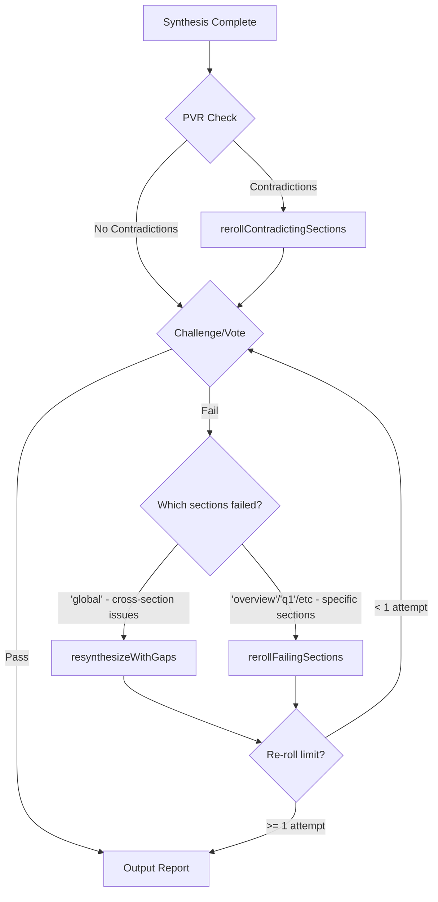
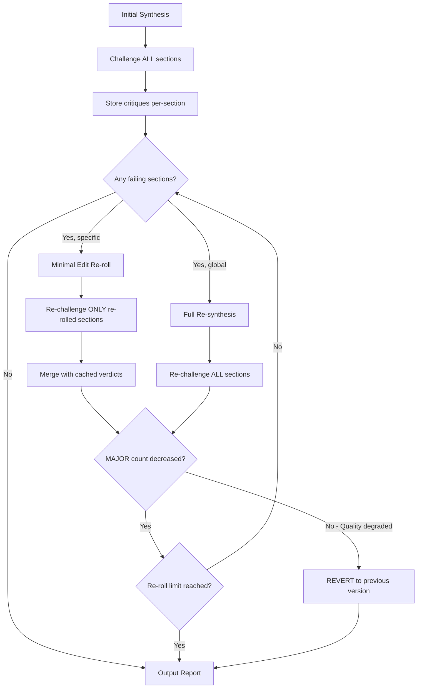
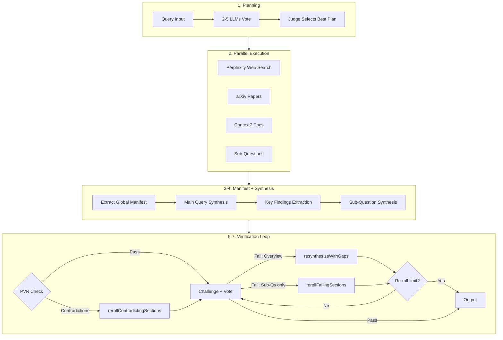

# Architecture

Technical reference for Research MCP Server internals.

## Overview

Research MCP Server implements a multi-phase research pipeline with consensus-driven planning and PVR (Parallel-Verify-Resolve) consistency verification.

## Research Pipeline

```
Query → Planning → Execution → Manifest → Synthesis → PVR → Validation → Output
```

### Phase 1: Consensus Planning

Multiple LLMs (2-5) vote on research strategy:

1. Each model proposes a research plan with complexity level (1-5)
2. A judge model selects the best plan based on coverage and feasibility
3. Plan determines which tools to use (perplexity, arxiv, context7, etc.)

**Files:** `src/planning.ts`, `src/judge.ts`

### Phase 2: Parallel Execution

Data gathering runs in parallel:

- Web search (Perplexity API)
- Academic papers (arXiv API with LLM relevance filtering)
- Library documentation (Context7)
- Sub-question research (inherits parent plan tools)

**Files:** `src/execution.ts`, `src/services/arxiv.ts`, `src/services/perplexity.ts`

### Phase 3: Global Constraint Manifest

Before synthesis, extract key facts from sources to ensure consistency:

```typescript
interface GlobalManifest {
  keyFacts: string[];           // "threshold is 0.85 [arxiv:2310.03025]"
  numerics: Record<string, number>;  // { entailmentThreshold: 0.85 }
  sources: string[];            // ["arxiv:2310.03025", "perplexity:1"]
}
```

The manifest is injected into all synthesis prompts so parallel calls share consistent facts.

**Research basis:** arxiv:2310.03025 (PVR architecture)

**Files:** `src/synthesis.ts` (extractGlobalManifest, formatManifestForPrompt)

### Phase 4: Phased Synthesis

Token-efficient approach for queries with sub-questions:

1. **Main query synthesis** - comprehensive answer to primary question
2. **Key findings extraction** - ~500 token summary
3. **Sub-question synthesis** - parallel, with key findings + manifest injected

**Files:** `src/synthesis.ts`

### Phase 5: PVR Verification

Parallel-Verify-Resolve architecture for consistency:

1. **Claim Extraction**: Break each section into atomic claims
2. **Cross-Sectional NLI**: Compare claims across sections for contradictions
3. **Entailment Scoring**: Calculate consistency score (target >= 0.85)
4. **Speculative Re-rolling**: Only regenerate contradicting sections

```typescript
interface PVRVerificationResult {
  entailmentScore: number;      // 0-1, target >= 0.85
  isConsistent: boolean;
  contradictions: Array<{
    sectionA: string;
    sectionB: string;
    claimA: string;
    claimB: string;
    severity: 'high' | 'medium' | 'low';
  }>;
  sectionsToReroll: string[];
}
```

**Research basis:**
- arxiv:2310.03025 (Parallel RAG consistency)
- arxiv:2305.14251 (Cross-sectional NLI)
- arxiv:2309.01431 (Timeout handling)

**Files:** `src/validation.ts` (runPVRVerification, runCrossSectionalNLI)

### Phase 6: Code Validation

Validates synthesized code against Context7 documentation:

1. Extract all code blocks from synthesis
2. Check against authoritative library docs
3. Fix hallucinated APIs, outdated syntax

**Files:** `src/validation.ts` (validateCodeAgainstDocs)

### Phase 7: Multi-Model Validation

Final quality checks:

1. **Critical Challenge**: LLM attacks synthesis using actionability checklist
2. **Consensus Validation**: Multiple LLMs evaluate research quality (depth >= 4)
3. **Sufficiency Vote**: Synthesis vs. critique comparison

**Files:** `src/validation.ts` (runChallenge, runConsensusValidation, runSufficiencyVote)

### Phase 8: Targeted Re-Synthesis

The system uses three re-synthesis strategies based on the type of failure detected:



| Function | Trigger | Strategy | Context Injection |
|----------|---------|----------|-------------------|
| `resynthesizeWithGaps` | `'global'` in failingSections (PVR cross-section only) | Full re-synthesis | Appends gap descriptions to entire context |
| `rerollContradictingSections` | PVR detects contradictions | Targeted re-roll | Injects manifest facts + contradiction details |
| `rerollFailingSections` | `'overview'`/`'q1'`/etc in failingSections | Targeted re-roll | Injects categorized critique details per section |

**Design Rationale:**
- **`'global'` is rare**: Only used for true cross-section contradictions detected by PVR, NOT for spread issues
- **Spread issues → targeted re-roll**: When 6 MAJOR issues are spread (e.g., 2 per section), all sections with MAJOR issues get re-rolled
- **`'overview'` = targeted overview re-roll**: Re-generates only the overview, keeping sub-questions as reference
- **`'q1'`/`'q2'`/etc = targeted sub-question re-roll**: Uses overview as anchor, re-generates only failing sub-questions
- **1 re-roll limit**: Prevents infinite loops while allowing one correction attempt

**HCSP Thresholds (Per-Section):**
- 1+ CRITICAL issues → Section fails
- 3+ MAJOR issues → Section fails
- Otherwise → Section passes

**Quality Control Mechanisms (R-235913):**

| Mechanism | Problem Solved | Implementation |
|-----------|----------------|----------------|
| **Convergence Criteria** | Re-rolls introducing new issues | Track MAJOR count before/after; revert if degraded |
| **Minimal Localized Edits** | Rewrites introducing new problems | Prompt LLM to fix ONLY specific critique, not rewrite |
| **Differential Validation** | Unchanged sections getting new critiques | Cache verdicts; only re-challenge re-rolled sections |
| **Median Aggregation** | Model outliers (gpt-5-nano finds 9x more MAJORs) | Use median instead of sum for vote counts |



**Files:** `src/controller.ts` (resynthesizeWithGaps, rerollContradictingSections, rerollFailingSections)

### Research-Backed Implementation

The system implements validated techniques from recent AI research:

| Technique | Paper | Implementation | File Location |
|-----------|-------|----------------|---------------|
| Diverse voting ensembles | R-212511, R-214931 | 3+ different model architectures (>98.8% success) | `src/clients/llm.ts` (`getVotingConfigs`) |
| Context-grounded validation | arxiv:2510.02340v2 | Atomic facts from web/papers as grounding context | `src/validation.ts` (`buildVotePrompt`) |
| Knowledge cutoff handling | arxiv:2403.12958v2 | Explicit context-only prompting (>95% effective) | `src/validation.ts` (`buildVotePrompt`) |
| Code validation criteria | arxiv:2411.12990v1 | BetterBench: illustrative vs production code distinction | `src/validation.ts` (`buildVotePrompt` CRITICAL_GAP) |
| JSON repair | Industry best practice | Clean trailing commas and quote normalization | `src/validation.ts` (`runCrossSectionalNLI`) |

**Key Research Findings:**
- **Multiple small diverse models** outperform single large models for consensus tasks (accuracy-to-cost ratio)
- **RAG grounding** prevents false positives when validating recent information (LLMs trust external context)
- **Placeholder API keys** are security best practices, not code quality issues (per BetterBench framework)

## Key Components

### LLM Client

Unified interface for multiple providers:

```typescript
callLLM(prompt, {
  provider: 'gemini' | 'openai' | 'anthropic',
  model: string,
  apiKey: string,
  timeout?: number,
  maxOutputTokens?: number,
  temperature?: number
})
```

**Files:** `src/clients/llm.ts`

### Research Controller

Orchestrates the full pipeline:

```typescript
const controller = new ResearchController(env);
const { markdown, sections, executiveSummary } = await controller.execute({
  query,
  enrichedContext,
  depthLevel,
  options
});
```

**Files:** `src/controller.ts`

### Section Architecture

Reports use sectioned structure for context-efficient reading:

```typescript
interface Section {
  title: string;
  summary: string;    // 50-100 word condensed version
  content: string;    // Full section content
  lineRange?: string; // For citations
}
```

**Files:** `src/sectioning.ts`, `src/types/index.ts`

## Data Flow



**Detailed ASCII Flow:**
```
┌─────────────────────────────────────────────────────────────────────┐
│                         Research Controller                          │
├─────────────────────────────────────────────────────────────────────┤
│  1. Planning                                                         │
│     └─> 2-5 LLMs vote on strategy                                   │
│                                                                      │
│  2. Execution                                                        │
│     ├─> Perplexity (web)                                            │
│     ├─> arXiv (papers)      [parallel]                              │
│     ├─> Context7 (docs)                                             │
│     └─> Sub-questions                                               │
│                                                                      │
│  3. Manifest Extraction                                              │
│     └─> Extract key facts from sources                              │
│                                                                      │
│  4. Synthesis                                                        │
│     ├─> Main query (with manifest)                                  │
│     ├─> Key findings extraction                                     │
│     └─> Sub-questions (parallel, with manifest)                     │
│                                                                      │
│  5. PVR Verification                                                 │
│     ├─> Extract claims                                              │
│     ├─> Cross-sectional NLI                                         │
│     └─> rerollContradictingSections if score < 0.85                 │
│                                                                      │
│  6. Code Validation                                                  │
│     └─> Check against Context7 docs                                 │
│                                                                      │
│  7. Challenge + Vote                                                 │
│     ├─> Critical challenge (section-attributed critiques)           │
│     ├─> Sufficiency vote (HCSP thresholds per section)              │
│     └─> Re-synthesis decision:                                      │
│         ├─> 'global' fails    → resynthesizeWithGaps (full)         │
│         └─> sections fail     → rerollFailingSections (targeted)    │
│                                                                      │
│  8. Output                                                           │
│     └─> Sectioned markdown + executive summary                      │
└─────────────────────────────────────────────────────────────────────┘
```

## Performance Characteristics

| Phase | Typical Duration | Parallelization |
|-------|------------------|-----------------|
| Planning | 10-15s | 5 LLMs in parallel |
| Execution | 15-30s | All tools in parallel |
| Manifest | 2-3s | Single LLM call |
| Synthesis | 15-30s | Sub-Qs in parallel |
| PVR Verification | 5-10s | Claim extraction in parallel |
| Code Validation | 3-5s | Single pass |
| Challenge/Vote | 5-15s | Vote in parallel |
| **Total** | **2-3 minutes** | |

## Error Handling

- **5s timeout** for verification calls (fail-open per arxiv:2309.01431)
- **Max 2 re-roll attempts** to prevent infinite loops
- **Fallback synthesis** if no API keys available
- **Rate limit management** with p-limit for parallel calls

## References

- [arxiv:2310.03025](https://arxiv.org/abs/2310.03025) - PVR architecture, 0.85 threshold
- [arxiv:2305.14251](https://arxiv.org/abs/2305.14251) - Cross-sectional NLI
- [arxiv:2309.01431](https://arxiv.org/abs/2309.01431) - Timeout handling strategies
- [arxiv:2303.16634](https://arxiv.org/abs/2303.16634) - G-Eval for LLM evaluation
- R-220053 - Targeted re-synthesis research (section-level critique attribution)
- R-224005 - HCSP 4-tier validation taxonomy (CRITICAL/MAJOR/MINOR/PEDANTIC)
- R-235913 - Iterative LLM refinement (convergence criteria, minimal edits, differential validation)
- R-000633 - Validation caching strategies (cache verdicts for unchanged sections)


